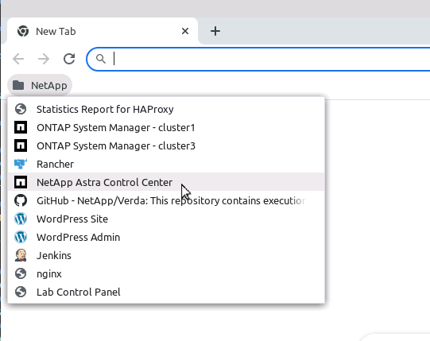
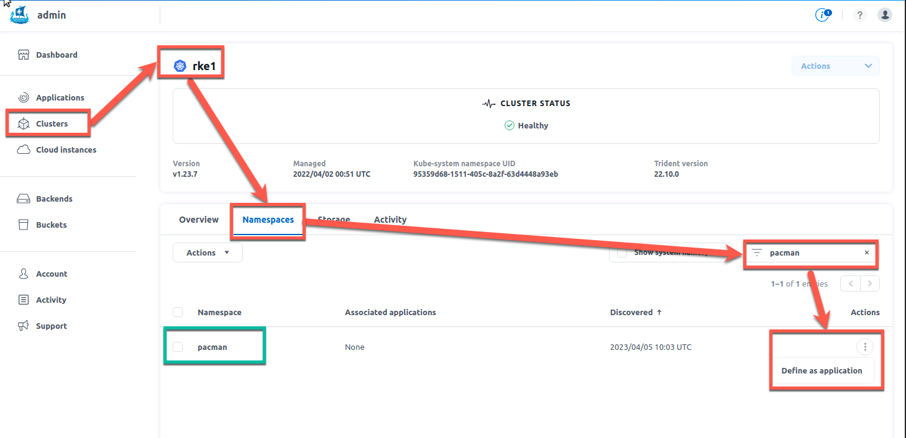
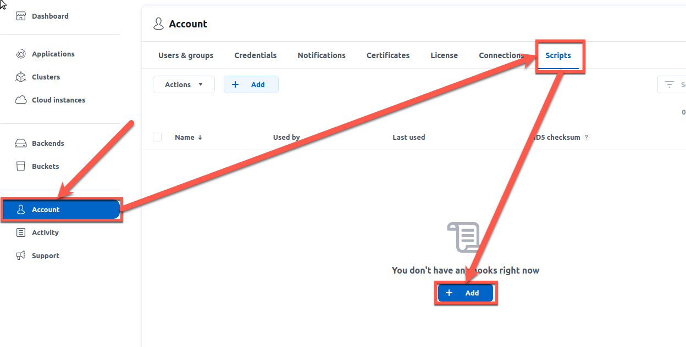
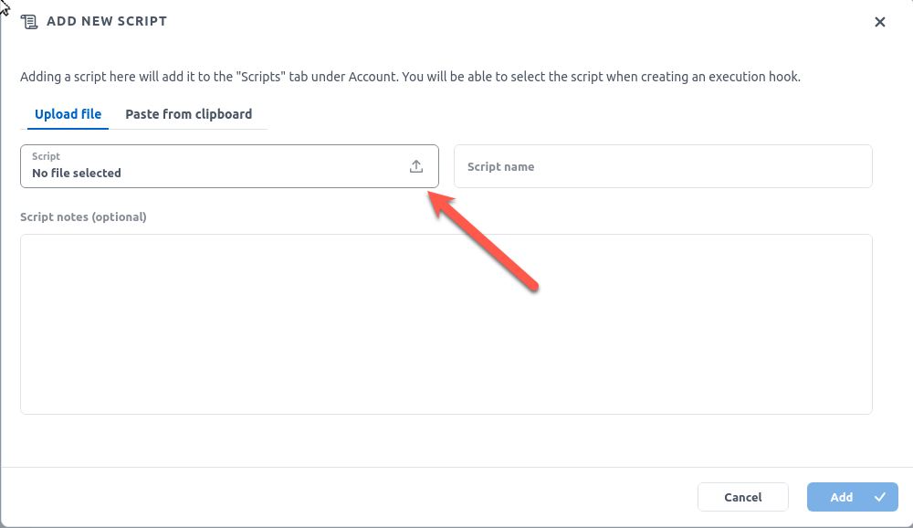
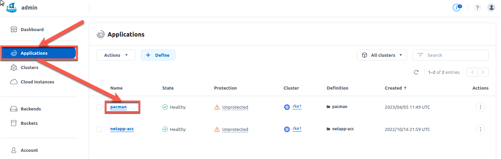
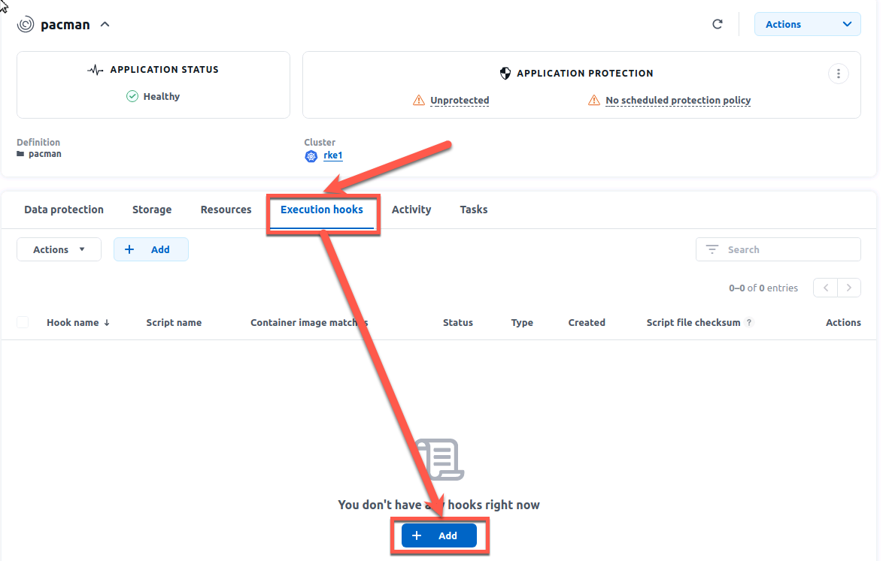
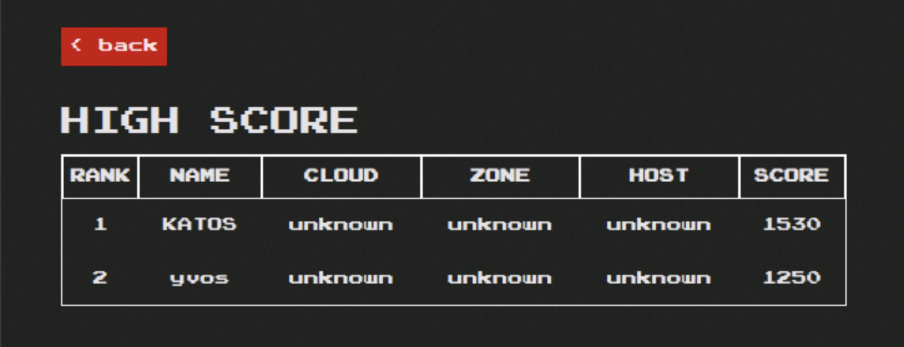

# Prework

```console
cd /home/user
git clone https://github.com/ntap-johanneswagner/insight2023
cd /home/user/insight2023/prework
bash prework.sh
rke2
kubectl apply -f rke2-pacman.yml
rke1
```

# show backends & scs
```console
kubectl get tbe -n trident
=> Backends zeigen
cat 0-backend-san.yaml
kubectl get sc
=> SC zeigen
cat 1-rke1_sc_san.yaml
sc anwenden
kubectl apply -f 1-rke1_san.yaml
sc zeigen =>
kubectl get sc
```
# show app
cat 2-pacman.yml
=> show ontap cluster and volume
kubectl describe pvc mongo-storage -n pacman
=> resize volume
kubectl patch -n pacman pvc mongo-storage -p '{"spec":{"resources":{"requests":{"storage":"10Gi"}}}}'
kubectl describe pvc mongo-storage -n pacman
=> resize volume to be smaller
kubectl patch -n pacman pvc mongo-storage -p '{"spec":{"resources":{"requests":{"storage":"8Gi"}}}}'

# demo snapshot
kubectl apply -f 03-busybox.yaml
kubectl get -n busybox all,pvc
kubectl exec -n busybox $(kubectl get pod -n busybox -o name) -- sh -c 'echo "Hello Roche" > /data/test.txt'
kubectl exec -n busybox $(kubectl get pod -n busybox -o name) -- more /data/test.txt


# :trident: Scenario 03 -  snapshots, clones etc 

The last line will provide you an output of our example environment. There should be one running pod and a pvc with 10Gi.

Before we create a snapshot, let's write some data into our volume.  

```console
kubectl exec -n busybox $(kubectl get pod -n busybox -o name) -- sh -c 'echo "Hello Roche" > /data/test.txt'
```

This creates the file test.txt and writes "NetApp Kompakt Live Lab 2023 is fun. I will never use anything other than Astra Trident for persistent storage in K8s" into it. You can verify the file contents:

```console
kubectl exec -n busybox $(kubectl get pod -n busybox -o name) -- more /data/test.txt
```

Creating a snapshot of this volume is very simple:

```console
kubectl apply -n busybox -f pvc-snapshot.yaml
```

After it is created you can observe its details:
```console
kubectl get volumesnapshot -n busybox
```
Your snapshot has been created !  

To experiment with the snapshot, let's delete our test file...
```console
kubectl exec -n busybox $(kubectl get pod -n busybox -o name) -- rm -f /data/test.txt
```

If you want to verify that the data is really gone, feel free to try out the command from above that has shown you the contents of the file:

```console
kubectl exec -n busybox $(kubectl get pod -n busybox -o name) -- more /data/test.txt
```

One of the useful things K8s provides for snapshots is the ability to create a clone from it. 
If you take a look a the PVC manifest (_pvc_from_snap.yaml_), you can notice the reference to the snapshot:

```yaml
dataSource:
  name: mydata-snapshot
  kind: VolumeSnapshot
  apiGroup: snapshot.storage.k8s.io
```

Let's see how that turns out:

```console
kubectl apply -n busybox -f pvc_from_snap.yaml
```

This will create a new pvc which could be used instantly in an application. You can see it if you take a look at the pvcs in your namespace:

```console
kubectl get pvc -n busybox
```

Recover the data of your application

When it comes to data recovery, there are many ways to do so. If you want to recover only a single file, you can temporarily attach a PVC clone based on the snapshot to your pod and copy individual files back. Some storage systems also provide a convenient access to snapshots by presenting them as part of the filesystem (feel free to exec into the pod and look for the .snapshot folders on your PVC). However, if you want to recover everything, you can just update your application manifest to point to the clone, which is what we are going to try now:

```console
kubectl patch -n busybox deploy busybox -p '{"spec":{"template":{"spec":{"volumes":[{"name":"volume","persistentVolumeClaim":{"claimName":"mydata-from-snap"}}]}}}}'
```

That will trigger a new POD creation with the updated configuration

Now, if you look at the files this POD has access to (the PVC), you will see that the *lost data* (file: test.txt) is back!

```console
kubectl exec -n busybox $(kubectl get pod -n busybox -o name) -- ls -l /data/
```
or even better, lets have a look at the contents:

```console
kubectl exec -n busybox $(kubectl get pod -n busybox -o name) -- more /data/test.txt
```

Tadaaa, you have restored your data!  
Keep in mind that some applications may need some extra care once the data is restored (databases for instance). In a production setup you'll likely need a more full-blown backup/restore solution.  


Now, a little clean up at the end:

```console
kubectl delete ns busybox
```

# :trident: Scenario 04 - Consumption control 
___
**Remember: All required files are in the folder */home/user/kompaktlivelab23/scenario04*. Please ensure that you are in this folder. You can do this with the command**
```console
cd /home/user/kompaktlivelab23/scenario04
```
___
There are many different ways to control the storage consumption. We will focus on the possibilities of K8s itself. However please remember: Sometimes the same thing can also be achieved at storage or csi driver level and it might be preferred to do it there.

You can create different objects to control the storage consumption directly in Kubernetes:

- LimitRange: controls the maximum (& minimum) size for each claim in a namespace
- ResourceQuotas: limits the number of PVC or the amount of cumulative storage in a namespace

For this scenario we will create and work in the namespace *control*.

You will create two types of quotas:

1. Limit the number of PVC a user can create
2. Limit the total capacity a user can consume

Take a look at _rq-pvc-count-limit.yaml_ and _rq-sc-resource-limit.yaml_ and then apply them:

```console
kubectl create namespace control
kubectl apply -n control -f rq-pvc-count-limit.yaml
kubectl apply -n control -f rq-sc-resource-limit.yaml
```

You can see the specified ressource quotas with the following command:

```console
kubectl get resourcequota -n control
```

Nice, they are there - but what do they do? Let's take a closer look:

```console
kubectl describe quota pvc-count-limit -n control
```

Ok we see some limitations... but how do they work? Let's create some PVCs to find out

```console
kubectl apply -n control -f pvc-quotasc-1.yaml
kubectl apply -n control -f pvc-quotasc-2.yaml
```

Again, have a look at the ressource limits:

```console
kubectl describe quota pvc-count-limit -n control
```

Two in use, great, let's add a third one

```console
kubectl apply -n control -f pvc-quotasc-3.yaml
```

So far so good, all created, a look at our limits tells you that you got the maximum number of PVC allowed for this storage class. Let's see what happens next...

```console
kubectl apply -n control -f pvc-quotasc-4.yaml
```

Oh! An Error... well that's what we expected as we want to limit the creation, right?
Before we continue, let's clean up a little bit:

```console
kubectl delete pvc -n control --all
```

Time to look at the capacity quotas...

```console
kubectl describe quota sc-resource-limit -n control
```

Each PVC you are going to use is 5GB.

```console
kubectl apply -n control -f pvc-5Gi-1.yaml
```

A quick check:

```console
kubectl describe quota sc-resource-limit -n control
```

Given the size of the second PVC file, the creation should fail in this namespace

```console
kubectl apply -n control -f pvc-5Gi-2.yaml
```

And as expected, our limits are working. 

Before starting the second part of this scenario, let's clean up

```console
kubectl delete pvc -n control 5gb-1
kubectl delete resourcequota -n control --all
```

We will use the LimitRange object type to control the maximum size of the volumes a user can create in this namespace. 

```console
kubectl apply -n control -f lr-pvc.yaml
```

Let's verify:

```console
kubectl describe -n control limitrange storagelimits
```

Now that we have create a 2Gi limit, let's try to create a 5Gi volume...

```console
kubectl apply -n control -f pvc-5Gi-1.yaml
```

Magical, right? By the way, the NetApp Trident CSI driver from this lab has a similar parameter called _limitVolumeSize_ that controls the maximum capacity of a PVC per Trident Backend. As we told you: sometimes there are multiple ways to achieve the same result. 

# :trident: Scenario 05 - Protect& Recover your application with Astra Control Center 
___
**This time, no files are needed, all information are in the guide**
___
You remember the Pac-Man application we've created earlier? The one with the very very important highscore data? Having the data stored in persistent volumes is only the half of a good data management. We have also to ensure that if bad things are happening, we can recover from them. For this we will use Astra Control Centern (short ACC).   

We will use Astra Control Center to create :
- a manual snapshot (ie on-demand)
- a manual backup (ie on-demand)
- a protection policy to automatically take consistent snapshots & backups

All the work we will do in the UI can be done by API. We will work with the UI today as it is easier for demos.

To access the UI, open the webbrowser and choose NetApp Astra Control Center

<p align="center"></p>

To login use the username *admin@demo.netapp.com* and the password *Netapp1!*

<p align="center"></p>

Pacman runs on RKE1, so let's discover it in ACC.  
You can either browse through the numerous namespaces already present on RKE1 (_not that many_ ...), or filter directly with the namespace name:  
<p align="center"></p>

Once you define this namespace as an ACC application, the first task run by ACC will be create a list of all resources that compose Pacman.  
Back to the applications screen of ACC, you will see a _healthy_ Pacman, which is however _not protected_ (just yet).
<p align="center"></p>

One of the many strengths of Astra Control is to integrate with the applications to protect, through hooks, in order to create consistent snapshots & backups. Some hooks are already available on this [link](https://github.com/NetApp/Verda). 
You can add the scripts while creating a new hook or as they are global anyway, you can add them before creating a hook.
Let's start to add a script for the mongo db hooks. 

<p align="center"></p>

You could paste the code directly from your clipboard or just upload a ready script.

<p align="center"></p>

The Verda repository is cloned to the user directory of the jumphost, so we can upload the script from an existing file. It is located at /user/Verda/MongoDB

<p align="center"></p>
<p align="center"></p>

After a click on "Add", you should now see the added script in your Account

<p align="center"></p>

Let's create a _pre-snapshot_ & a _post-snapshot_ hooks for the MongoDB in the pacman app as this is the underlying database used to store the scores of this game. 

First you have to go back to the application and access its details:

<p align="center"></p>

Now you have to go to the Execution Hooks section and add a new one:

<p align="center"></p>

You could decide to apply hooks to all containers of an application, or just specific containers with a filtering option. We will choose the latter & filter on `.*mongo.*` in order to manage the database. Create two hooks, one for pre-snapshot and one for post-snapshot  

<p align="center"></p>   

<p align="center"></p>

Once done, you can see that the hooks have been applied on the right container, with the _mongo:3.2_ image.
<p align="center"></p>

Let's click on the _Data Protection_ tab to create a _Protection Policy_.
<p align="center"></p>

These policies will define when you take a _snapshot_, how many you want to keep at one point in time, & how many are to the _backup_ platform.
<p align="center"></p>

We can also manually create snapshots if you dont/cant wait for the first automated snapshot to be taken.  
It is as easy as just chosing a name for this snapshot:
<p align="center"></p>

It just takes a few seconds to complete. You end up with a healthy brand new snapshot.  
<p align="center"></p>

The same applies to _backups_. Let's manually create one, based on the snapshot we just added.
<p align="center"></p>

It takes a little bit more time (couple of minutes) to complete, as there is data movement involved this time.  
Nonetheless, we end up with a healthy backup.
<p align="center"></p>

With _snapshots_, _backups_ configured, now Pacman is protected from all evil !
<p align="center"></p>

In addition to snapshots and backups, Astra Control Center is also offering a replication for DR purposes. Due to time constraints we are not covering this in the LiveLab

Now let's brake some stuff and recover it.

We currently are in a safe zone. Pacman is running. Snapshots & backups are planned, as well as mirroring.  
Similarly to most fairy tales, an evil person joins the party !

```bash
kubectl exec -it -n pacman $(kubectl get pod -n pacman -l "name=mongo" -o name) -- mongo --eval 'db.highscore.updateMany({},{$set:{name:"EVIL",cloud:"YOU",zone:"HAVE BEEN",host:"HACKED",score:"666"}});' pacman
```

<p align="center">:boom: :boom: :boom: :boom: :boom: :boom: :boom: :boom: :boom: :boom: :boom: :boom: :boom: :boom: :boom: :boom:</p>  
<p align="center"></p>
<p align="center">:boom: :boom: :boom: :boom: :boom: :boom: :boom: :boom: :boom: :boom: :boom: :boom: :boom: :boom: :boom: :boom:</p>  

As a great wise man would say: "oh oh !"  

No worries, you did all the necessary to protect your application.  
In your case, you can simply perform an _in place restore_ operation from the first manual backup you took.

For this, enter the pacman application again, go to *Data protection*, choose *backups* and click on *Restore application*.  
<p align="center"></p>

<p align="center"></p>

When clicking on _Next_, you will also need to confirm the restore operation, as you will replace the existing content with the backup.  
After a few minutes, there you go, the famous high scores are back ! It might be that the IP adress of the pacman app is changed as we did a complete restore of the application. Just do a `kubectl get svc -n pacman` to verify that you are trying to access the right IP.

<p align="center"></p>

& Once again, Astra Control saved the world from evil !

# :trident: The End :trident:

Thank you for participating in this NetApp Kompakt LiveLab. We hope it was fun and you've learned something. We tried to cover the basics, there is a lot more to learn and talk. If you want to discuss further, cfeel free to reach out to us online or contact your NetApp Account Team and ask them to schedule a meeting with us.

Hendrik Land: [Linkedin](https://www.linkedin.com/in/hendrik-land/) / [E-Mail](mailto:hendrik.land@netapp.com)

Johannes Wagner: [Linkedin](https://www.linkedin.com/in/johwagner/) / [E-Mail](mailto:johannes.wagner@netapp.com)


